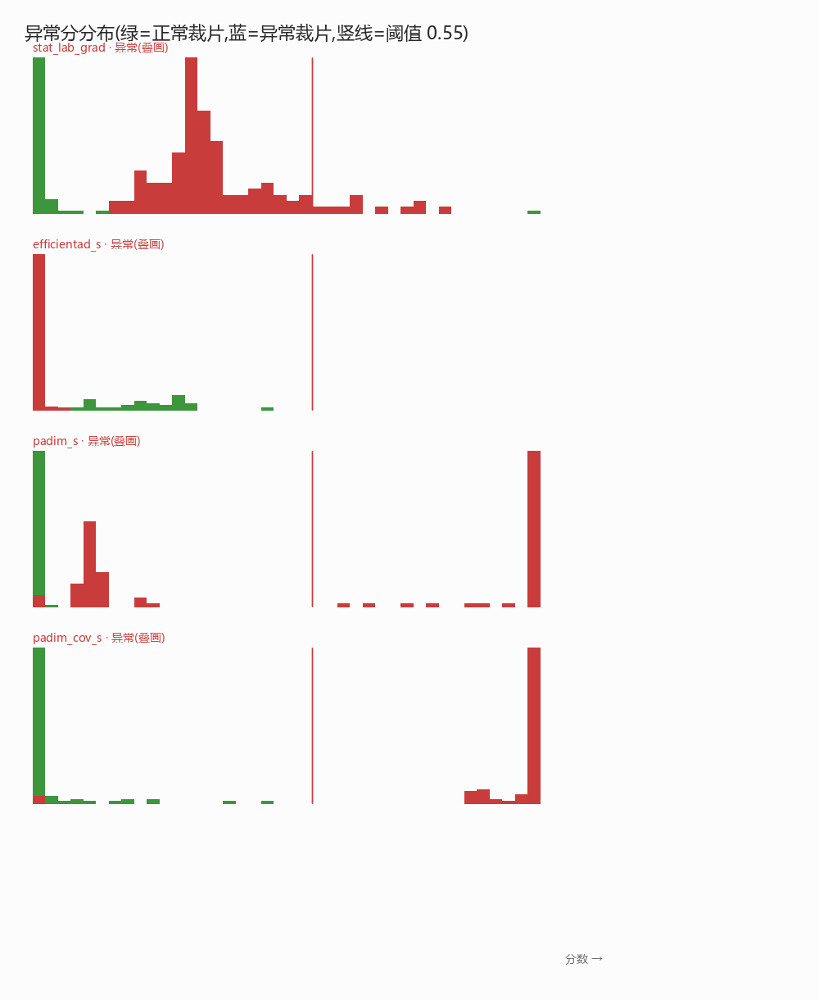
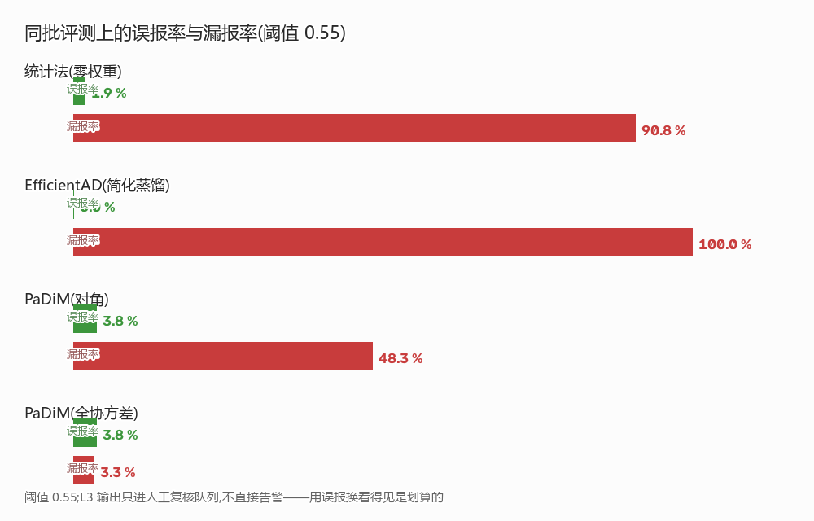
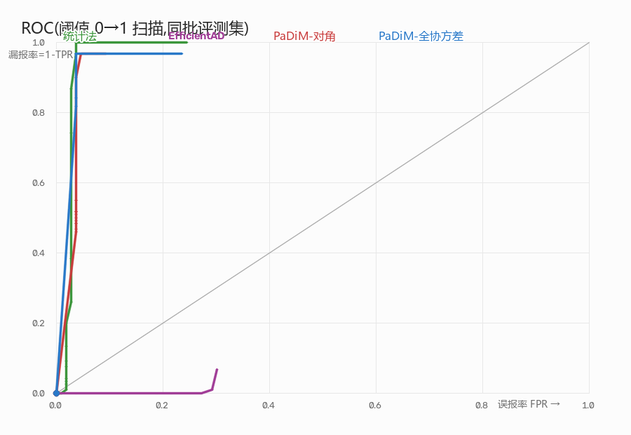

# 丙 · L3 未知异常检测 交付

> 对应任务书第 3 项「未知异常检测」+ 第 2 项「模型部署」的导出链路。

## 一句话结论

同一批评测集上,**PaDiM 标准版(全协方差)**把异常漏报率从统计法的 90.8 %
压到 **3.3 %**,误报率 3.8 %——训练集经过"复核几何 + 检测框抖动"增广后,
标准做法全面胜出;EfficientAD 简化蒸馏实测分数倒挂(漏报 100 %),未采用,
原因与数据一并记录在案。

## 关键数字

评测条件:训练集 = **796 张正常裁片**(gen_synthetic 密度分层 259 张 +
复核几何/检测框抖动增广 537 张);评测集 = 另种子正常裁片 106 张 +
**异常裁片 120 张**(场景 FOREIGN_OBJECT 60 + 训练与场景都没见过的
合成贴片 60);阈值统一 0.55。

| 指标 | 统计法(基线,零权重) | EfficientAD(简化蒸馏) | PaDiM(对角) | **PaDiM(全协方差,采用)** |
|---|---|---|---|---|
| 误报率(正常裁片) | **1.9 %** | 0.0 % | 3.8 % | 3.8 % |
| 漏报率(异常裁片 120) | 90.8 % | 100.0 %(分数倒挂) | 48.3 % | **3.3 %** |
| 正常均分 / 异常均分 | 0.03 / 0.36 | 0.07 / 0.00 | 0.04 / 0.56 | 0.06 / **0.95** |
| 权重大小 | 1.6 KB | 2.8 MB | 3.1 MB | ~44 MB(含 1024×100² 协方差) |
| 可解释 | ✅ 说得清哪个通道 | ❌ | ❌ | ❌ |
| 单次打分(CPU) | 6 ms | 未启用 | 22 ms | 26 ms(部署目标 NPU) |

**两个决定结果的实测发现(写进报告,比数字本身更值钱)**:

1. **训练裁片必须模拟运行时的检测框噪声。** 系统喂给 L3 的是检测框(有
   抖动),会把表盘"切边"——实测切边 12 % 的正常表盘,异常分从 0.5 跳到
   1.0。增广集加入抖动框后,系统实测的复核 ROI(600 s 跑出来的 6 张)从
   "全部 1.0 误报"回到正常分(0.00-0.09)。
2. **L3 与 L2 的分工在这个数据上看得见**:开位开关被 L2 判
   READING_ABNORMAL(状态异常,外观正常),L3 对它的外观给正常分——外观
   异常(FOREIGN_OBJECT)才是 L3 的菜,两层各司其职。

## 图


四种方法的正常/异常分数分布(竖线 = 阈值 0.55)。全协方差 PaDiM 两簇几乎
完全分开,对角版在增广后区分度下降,统计法只抬不越线,EfficientAD 倒挂。


同批评测上的误报率/漏报率条形图。


阈值 0→1 扫描。全协方差 PaDiM 贴左上角,整条曲线站得住。

## 怎么复现

```bash
# 1. 正常样本集 + 复核几何/抖动框增广(CPU,约 3 分钟)
python -m training.gen_synthetic --n 300 --out training/datasets/normal_patches
python -m training.augment_verify_geometry

# 2. 四种方法
python -m training.train_anomaly --data training/datasets/normal_patches \
    --backend statistical --out training/runs/anomaly/baseline.json
python -m training.train_anomaly --data training/datasets/normal_patches \
    --backend padim_cov --device cpu --out training/runs/anomaly/padim_cov.pt
python -m training.train_anomaly --data training/datasets/normal_patches \
    --backend padim --device cpu --out training/runs/anomaly/padim.pt
python -m training.train_anomaly --data training/datasets/normal_patches \
    --backend efficientad --device cpu --epochs 50

# 3. 同批评测 + 出图(评测集自动生成)
python -m training.bench_anomaly --out deliverables/丙-异常/figures

# 4. ONNX 导出与冒烟
python -m training.export_padim_onnx
```

接进系统:configs/system.yaml 已设 `perception.l3.model: padim_s` +
`weights: training/runs/anomaly/padim_cov.pt`(权重里带全协方差,推理侧自动
按 arch 切换打分);权重缺失或 torch 未装时自动退回统计法。L3 只对 ≥60 px
的检出打分(训练分布同源,巡航期异常目标 ≈83 px 仍被扫到)。

## 未做 / 未验证

- **L3 结论进证据包**:DetectionEvent 携带 l3_anomaly,但 manifest 目前不落
  盘 L3 字段(接口冻结,增字段要走 ICD 评审)
- **RKNN 转换与 INT8 掉点**:rknn-toolkit2 仅支持 x86 Linux,本机 Windows
  无 WSL。ONNX 导出与冒烟已通过(逐元素差 <4e-6,正常/异常分离 17 倍),
  转换脚本与校准集已备好,见 artifacts/rknn_export.md
- **上板测速**:缺 RK3576 板子
- **EfficientAD 完整版**(多层特征 + 自编码器分支 + 难例挖掘):简化蒸馏版
  实测倒挂后未继续投入,理由与数据见 artifacts/l3_report.json
- **证据包当训练集**:600 s 实测只攒 6 张正常 ROI(抑制规则限制重复复核),
  数量不足以单独训练;这 6 张在最终模型上全部正常分——作为分布覆盖的
  sanity check 通过,但"证据包路线"需要更长采集时间,结论如实记录
