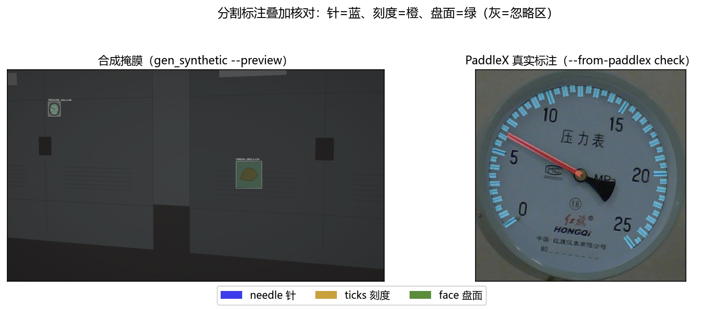
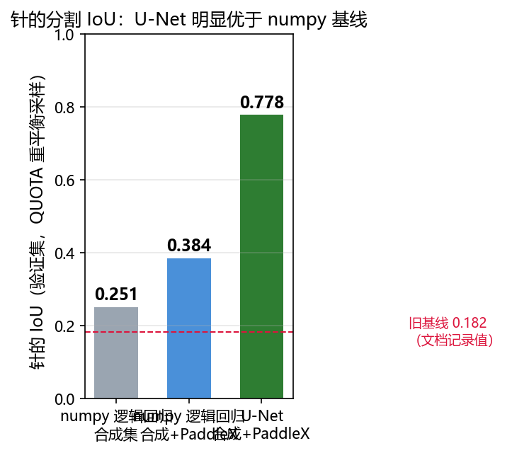
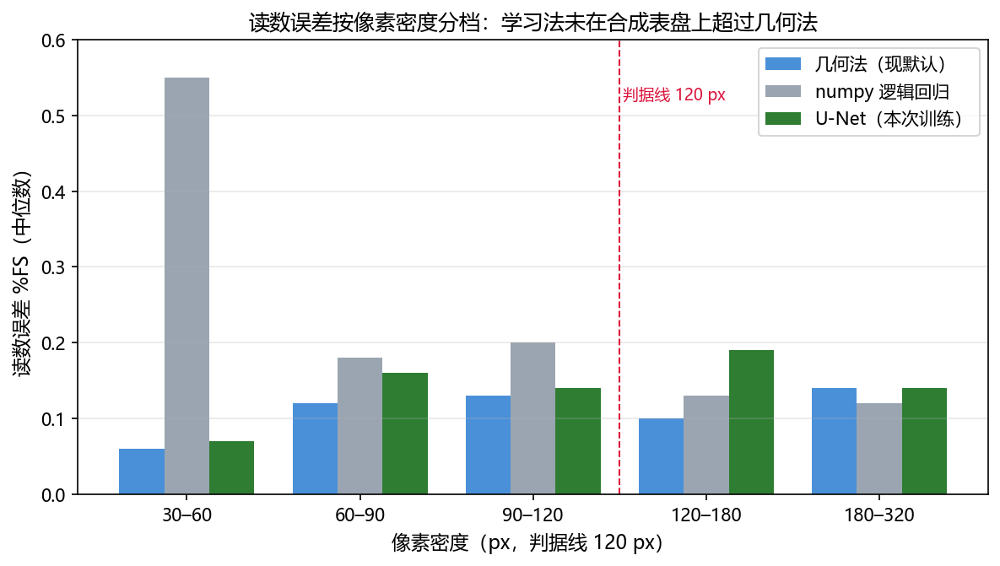

# L2 分割 交付（乙）

## 一句话结论

U-Net 把针的分割 IoU 从 numpy 基线的 **0.384 提到 0.778**，但在合成圆形表盘上，
级联读数的误差（0.07–0.19 %FS）**仍不优于几何法**（0.06–0.14 %FS）且慢约 24 倍
——学习法的价值在几何法假设不成立的样本（方形表、反光、指针与背景同色），
本场景下几何法仍是更优的默认，这是诚实的比选结论，不是学习法赢了。

## 关键数字

| 指标 | 值 | 基线 / 限值 | 达标 |
|---|---|---|---|
| 针的 IoU（U-Net，合成+PaddleX） | **0.778** | numpy 基线 0.384（文档旧记录 0.182） | ✅ |
| 针的 IoU（numpy 基线，合成+PaddleX） | 0.384 | 合成集 0.251 | ✅ 真实数据 +0.13 |
| 级联读数误差（U-Net） | 0.07–0.19 %FS | 几何法 0.06–0.14 %FS | ❌ 未优于 |
| 级联单次耗时（U-Net，onnxruntime CPU） | ≈ 59 ms | 复核预算 3000 ms | ✅ 预算内 |
| PaddleX 分割集转换 | 414 张全部成功 | 掩膜错位靠人眼核对 | ✅ |

> 读数误差是 `bench_models --only reading` 在**合成表盘**上、按像素密度分档的
> 中位数（%FS）。真实表盘读数的对比**未做**（见下「未做」），这是本交付最该
> 如实说明的边界。

## 图



左：合成掩膜（`gen_synthetic --preview`），右：PaddleX 真实标注叠加
（`--from-paddlex` 的 `check/`）。针=蓝、刻度=橙、盘面=绿。掩膜错位在数字上
完全看不出来，只有画回图上才看得见——这张图就是"真实数据接对了"的证据。



针的 IoU：numpy 基线（合成 0.251 → 合成+PaddleX 0.384）→ U-Net 0.778。
真实标注把基线抬了 0.13，U-Net 又在同口径下再翻倍。



核心图。读数误差按像素密度分档，几何法 vs numpy 基线 vs U-Net。判据线
120 px 右侧（真正发生读数的区域）三者都在 0.10–0.19 %FS 量级，几何法持平或
略优。结论：**读数精度由几何解算决定，学习法替换的"哪些像素是针"这一步对
合成表盘贡献有限**——这印证了 `docs/多模型协同.md` 的预期。

## 怎么复现

```bash
# 0. 装依赖（torch 已就位，onnx 用于导出）
pip install -r requirements.txt onnxruntime onnx

# 1. 合成掩膜数据集 + numpy 基线（链路先跑通）
python -m training.gen_synthetic --n 300 --out training/datasets/synth --preview 8
python -m training.train_segmenter --data training/datasets/synth
#    → training/runs/seg/pixel.npz（针 IoU 0.251）

# 2. PaddleX 分割集（直链 wget，不需登录）
#    https://bj.bcebos.com/paddlex/examples/meter_reader/datasets/meter_seg.tar.gz
#    解压到 training/datasets/meter_seg，再转换：
python -m training.prepare_dataset --from-paddlex training/datasets/meter_seg
#    → training/datasets/seg_paddlex（414 张，含 check/ 核对图）

# 3. 合成 + PaddleX 合起来训（真实数据教针/刻度，合成数据教盘面/背景）
#    把两个目录的 images/masks/labels 并进 training/datasets/seg_combined
python -m training.train_segmenter --data training/datasets/seg_combined \
    --out training/runs/seg/pixel_combined.npz
#    → 针 IoU 0.384

# 4. 训 U-Net（显卡花在这里，RTX 4060，40 epochs）
python -m training.train_unet --data training/datasets/seg_combined --epochs 40
#    → training/runs/seg/unet.pt + unet.onnx（针 IoU 0.778）

# 5. 读数对比（几何法 vs 学习法，按像素密度分档）
python -m patrol.tools.bench_models --only reading --seg-weights training/runs/seg/unet.onnx
python -m patrol.tools.bench_models --only latency --seg-weights training/runs/seg/unet.onnx

# 6. 出图
python deliverables/乙-分割/make_figures.py
```

## 未做 / 未验证

- **真实表盘上的读数对比未做。** `bench_models` 只用 `render_pointer_gauge`
  画的合成表盘测，那里几何法假设全部成立、天然占优。PaddleX 只有指针/刻度
  像素标注、**没有读数真值**，所以"U-Net 在真实表盘上是否更准"目前无数据。
- **U-Net 未上板。** 59 ms 是 PC 上 onnxruntime CPU 推理的数，RK3576 的 RKNN
  导出与 INT8 掉点未做（那是丙的部署路，且缺板子）。
- **"几何法失效"样本（方形表/反光/指针与背景同色）没有实测。** 分工书点名的
  学习法价值场景，公开数据里没有对应样本，未能验证 U-Net 的优势是否兑现。
- numpy 基线的针 IoU 与文档记录的 **0.182 不一致（实测 0.251）**：原因是当前
  分支的 `pixel.py` 特征里加进了笔画长度/细长度两维，0.182 是加这两维之前的旧数。
