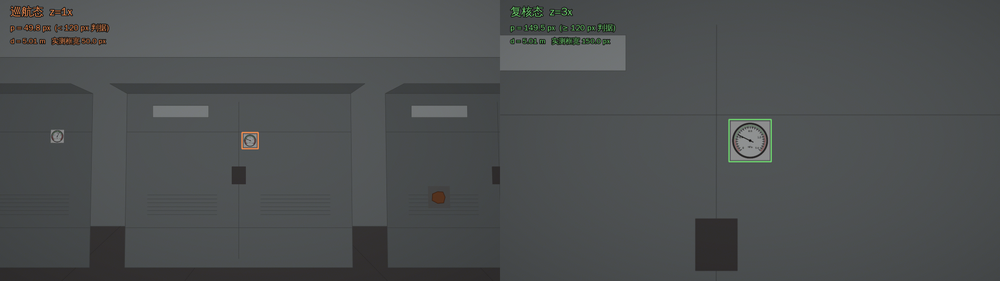
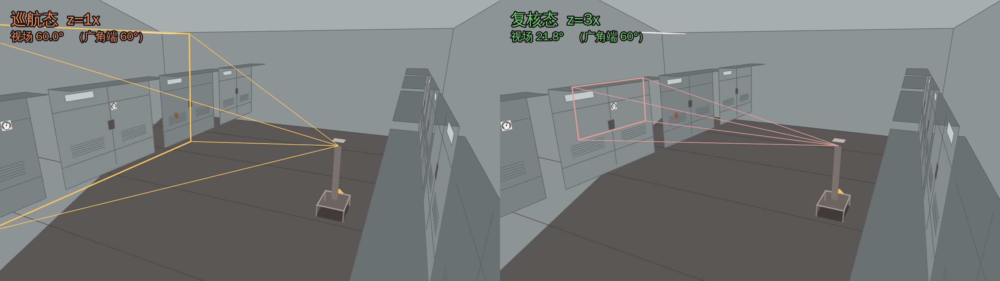
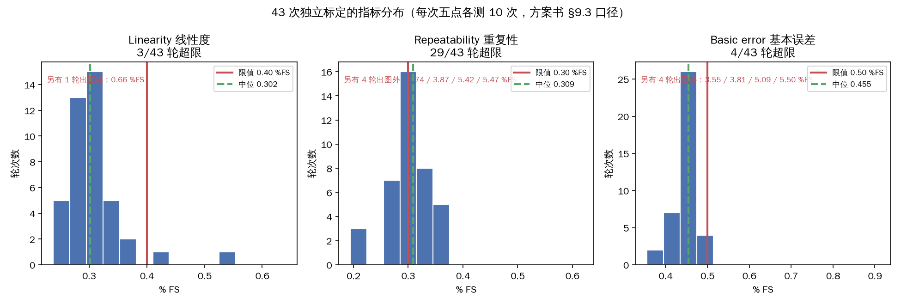

# 组长 · 系统与交付

> 对应任务书第 1 / 6 / 7 / 8 项（系统集成、证据包与告警分级、云端与模型版本管理、
> 实时性与稳定性），以及方案书 §11.1 交付物里的**标定记录**与**PID 整定记录**。

## 一句话结论

系统级的四项指标里**三项达标、一项超差**：读数基本误差 0.455 %FS（限值 0.5）、
线性度 0.302 %FS（限值 0.4）、云台超调 1.0 %／调节 1.10 s（限值 10 %／1.5 s）
全部达标；**重复性 0.309 %FS 超差（限值 0.3），43 次独立标定里 29 次不合格**——
这不是某次运气差，是系统性地压在限值上，**不调参数把它凑过去**。

## 关键数字

### 测量精度（43 次独立标定，方案书 §9.3 口径：五点各测 10 次）

| 指标 | 限值 | 中位 | 区间（剔除量级失控后） | 超限轮次 | 达标 |
|---|---|---|---|---|---|
| 基本误差 | ≤ 0.5 %FS | **0.455** | 0.356–0.486 | 4 / 43 | ✅ |
| 线性度 | ≤ 0.4 %FS | **0.302** | 0.238–0.661 | 3 / 43 | ✅ |
| **重复性** | ≤ 0.3 %FS | **0.309** | 0.194–0.358 | **29 / 43** | ❌ **超差** |

### 云台控制（方案书 §9.3 三项）

| 指标 | 限值 | z=1 | z=3 | 达标 |
|---|---|---|---|---|
| 超调量 | ≤ 10 % | 4.1 % | **1.0 %** | ✅ |
| 调节时间 | ≤ 1.5 s | 0.801 s | **1.101 s** | ✅ |
| 稳态误差 | ≤ 20 px | 10.4 px | **8.4 px** | ✅ |
| 关掉增益调度（z=3） | — | — | **42.7 %** | 对照组 |

### 光学与判据

| 指标 | 实测 | 公式 | 偏差 |
|---|---|---|---|
| 巡航像素密度（z=1, 5 m） | 50.0 px | 49.8 px | +0.4 % |
| 复核像素密度（z=3, 5 m） | 150.0 px | 149.5 px | +0.3 % |
| 水平视场角（z=1） | **59.95°** | 60.00° | **−0.05°** |

### 系统与接口

| 项 | 值 |
|---|---|
| 接口一致性校验 | 57 项全绿（11 条反例、5 份 Schema、网关↔Schema 交叉比对） |
| 测试 | 505 条用例，1 skip |
| 接口版本 | ICD **v2.0**，报文 `schema_version` **2.0.0**，D3 决议 24 条全部落地 |
| 云端模型登记 | **5 条**（此前 0 条） |

## 图



同一块压力表，巡航态 50.0 px（指针读不出来）、3× 变焦后 150.0 px（刻度清晰可读）。
**这是整个项目的立论**，公式算出来 49.8 / 149.5，吻合到 0.4 %。



同一件事从旁边看：视锥从 60° 收到 21.79°，正好套住那块表。**和上一张必须放一起**——
一个从车的眼睛里看，一个从旁边看着车，合起来「停车→对准→变焦→再看一眼」不用再解释。


云台阶跃响应。前两条只说明参数整好了；**第三条（关掉增益调度）才是重点**：
同样的 PID 参数、同样的对象，只是不按变焦倍率折算控制量，超调从 1.0 % 变成 42.7 %。
这是方案书 §6.3.2 那段推导唯一的实测证据。


五点读数标定曲线与残差，`R = 0.005901·θ + 0.799523`。



**唯一一张承认指标没达标的图。** 43 次独立标定的三项指标分布，红线是限值。
重复性那一格里，限值线正好穿过分布的中间——29/43 落在右侧。

## 重复性为什么不达标：两件事，不是一件

**第一，主体是系统性的，压在限值上。** 中位 0.309，区间 0.194–0.358。
`README.md` 原来把它归因于「合成检测器注入的检测框抖动」——**标定这条路径上这条
归因不成立**：`calibrate` 走的是渲染器给的目标框，43 轮 2450 次读数里
`pixel_density` 全部是同一个值 149.460，**根本没有检测框抖动**。
真正的来源是逐点的角度依赖：五个标定点的偏离中位差了近 8 倍
（0.028°–0.219°），最差的是指针指向正上方那一点。这条留给乙（读数那一路）追。

**第二，另有一类量级失控，主体统计里看不见。**
2450 次读数里有 **6 次**（0.245 %）偏离该点中位 **2.0–14.7°**，单独把所在那一轮的
重复性从 ~0.31 推到 **3.7–5.5 %FS**。它的成因是表盘椭圆拟合退化，不是随机噪声：

| 判据 | 2444 次正常读数 | 6 次失控读数 | 取阈值后 |
|---|---|---|---|
| `confidence` | **全部恰好 1.000** | 全部 ≤ 0.879 | < 0.90 → 抓 6/6，误伤 0 |
| `axis_ratio` | 全部 ≥ 0.9972 | 全部 ≤ 0.985 | < 0.99 → 抓 6/6，误伤 0 |

**算法当时就知道自己不确定，是标定工具没听。** 运行时的 `fusion._confidence()`
会把 `reading_confidence` 折进总置信度、压低分进人工复核；`calibrate` 则把所有
`ok` 的读数一视同仁地平均。这个口径差已经补上：`calibrate` 现在**并列**报一个
「剔除算法自报低置信度读数」的数，**主指标仍按方案书 §9.3 原样算、原样报**。
阈值 0.90 是上表实测定下来的，不是拍的。

**为什么不调参数把它凑过去。** 因为凑过去等于把误差藏起来——真机上同样的失效
还会发生，只是那时没人知道它曾经在仿真里出现过。这一条按仓库既有习惯挂在
`README.md` 的当前状态表里，并写进 D3 待办。

## 怎么复现

```bash
# 1. 五点标定（单次，约 40 s）
python -m patrol.tools.calibrate --out deliverables/组长-系统/artifacts/calib

# 2. 指标分布（N 次独立标定，每次换种子；N=43 约 30 分钟）
mkdir -p /tmp/cal
for s in $(seq 1 43); do
    python -m patrol.tools.calibrate --seed $s --out /tmp/cal/s$s > /tmp/cal/s$s.log
done
python deliverables/组长-系统/make_figures.py --logs '/tmp/cal/s*.log'

# 3. PID 整定与阶跃响应
python -m patrol.tools.tune_pid --tune --compare-gain-schedule \
    --out deliverables/组长-系统/artifacts/pid

# 4. 立论那两张图
python -m patrol.tools.viewer --demo-zoom        --out deliverables/组长-系统/figures
python -m patrol.tools.viewer --demo-thirdperson --out deliverables/组长-系统/figures

# 5. 稳定性与断网降级（约 20 分钟，**必须独占跑**，见下）
python -m patrol.tools.run_all --seconds 300 --quiet     # ×3
python -m patrol.tools.run_all --seconds 75 --no-cloud --quiet

# 6. 模型版本登记
python -m patrol.tools.register_models
```

> ⚠ **稳定性那一步不能和别的 `run_all` 并行跑。** 两个实例会撞在 8000 端口与
> 同一组 `bus.*` 上，云端直接以返回码 3 退出，三轮数据全废——这个坑本次踩过一次。

## 未做 / 未验证

1. **三块屏幕的开窗演示未验**（`viewer --live` / `--thirdperson`、浏览器台账）——
   彩排机无显示器。数据面已验、**呈现面未验**，答辩前必须在有显示器的机器上补一遍，
   逐条见 [`彩排记录.md`](彩排记录.md)。
2. **重复性的角度依赖未定位到具体代码**。已确认不是检测框抖动、且逐点差近 8 倍，
   但没有追到 `pointer.py` 的哪一步。这条属于 L2 读数通路，建议转给乙。
3. **真镜头的视场角未测**。59.95° 验的是渲染器与光学公式自洽，不是真镜头。
   ICD v2.0 §3.2 的「实测偏差 >3° 须重算」条款要等硬件到位才真正起作用。
4. **演示视频未录**。
5. 底盘固件 F1–F8 与 APM32 上的 UART 适配层——**本轮明确不做硬件**，未动。
